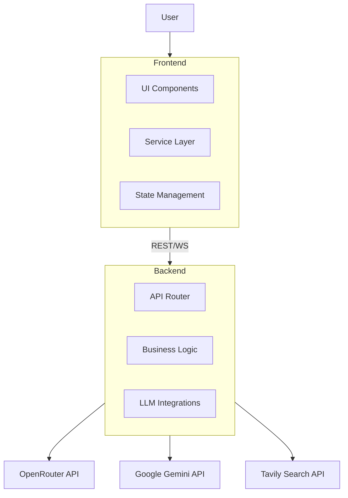

# 🤖 AssistMe V2.0 - Next-Gen AI Virtual Assistant

<div align="center">


**A production-ready, multi-modal AI platform featuring Advanced Voice Mode, Deep Research (Grokipedia), and Neural Speed Diagnostics.**

[](https://react.dev)
[](https://vitejs.dev)
[](https://fastapi.tiangolo.com)
[](https://python.org)
[](https://tailwindcss.com)
[](LICENSE)

[Live Demo](https://assist-me-virtual-assistant.vercel.app/) • [Report Bug](https://github.com/mangeshraut712/AssistMe-VirtualAssistant/issues) • [Request Feature](https://github.com/mangeshraut712/AssistMe-VirtualAssistant/issues)

</div>

---

## 🌟 Overview

**AssistMe** isn't just a chatbot; it's a comprehensive AI workspace designed for power users. Built on a modern **React + FastAPI** architecture, it integrates state-of-the-art LLMs (Gemini, Claude, GPT-4, Grok) with custom neural modules for specific tasks like deep research, image generation, and network diagnostics.

The **V2.0** update introduces a massively reorganized codebase, enterprise-grade architecture, and powerful new "applets" within the assistant.

---

## 🔥 Key Features

### 🧠 **Grokipedia (Deep Research)**
A revolutionary "Search & Synthesis" engine that generates comprehensive, wiki-style articles on any topic.
- **Deep Web Search:** Aggregates data from 10+ sources (Tavily, DuckDuckGo).
- **AI Synthesis:** Generates 2500+ word deep-dive articles with citations.
- **Streaming Architecture:** Real-time content generation with visible thought process.

### 🎙️ **Advanced Voice Mode**
Real-time, natural conversation with aggressively optimized latency.
- **Gemini Live Integration:** Zero-latency turn-taking.
- **"Thinking" Filter:** Scrubbing of internal chain-of-thought for pure speech output.
- **Visual Feedback:** Dynamic audio visualizers (Waveform, Orb, Bar) synchronized to speech.

### 🎨 **Imagine Studio**
A complete generative art workstation built right into the chat.
- **Multi-Model Support:** Flux 1.1, DALL-E 3, Stable Diffusion XL.
- **Style Presets:** One-click styles for Anime, Digital Art, Photorealism, and 3D Render.
- **Smart Prompting:** Automatic prompt enhancement for better results.

### ⚡ **Speedtest Ultra**
A professional-grade network diagnostic tool.
- **Neural Diagnostics:** Analyzes connection quality for specific use cases (Gaming, 4K Streaming).
- **Granular Metrics:** Measures Jitter, Bufferbloat, and Packet Loss alongside speed.
- **Real-time Graphs:** Visualization of TCP stream stability.

### 🇮🇳 **Native Multilingual Support**
First-class support for Indian languages.
- **22+ Languages:** Hindi, Marathi, Tamil, Telugu, Gujarati, and more.
- **Script Handling:** Correct rendering of complex Indic scripts.
- **Cultural Nuance:** Localized context understanding.

---

## 🏗️ Architecture

AssistMe V2.0 follows a clean, modular architecture designed for scalability.



### Directory Structure

| Directory | Purpose |
|-----------|---------|
| `src/components/features` | Standalone feature modules (Voice, Speedtest, Grokipedia) |
| `src/services` | centralized API wrappers and data fetching logic |
| `src/context` | Global state management (Theme, Auth) |
| `backend/app/routes` | API endpoint definitions |
| `backend/app/providers` | LLM provider abstraction layer |

---

## 🚀 Getting Started

### Prerequisites

- **Node.js** (v18+)
- **Python** (v3.10+)
- **API Keys:** OpenRouter (Required), Google Gemini & Tavily (Recommended)

### Installation

1.  **Clone the repo**
    ```bash
    git clone https://github.com/mangeshraut712/AssistMe-VirtualAssistant.git
    cd AssistMe-VirtualAssistant
    ```

2.  **Install Frontend**
    ```bash
    npm install
    ```

3.  **Install Backend**
    ```bash
    cd backend
    python -m venv venv
    source venv/bin/activate  # Windows: venv\Scripts\activate
    pip install -r requirements.txt
    ```

### Configuration

Create a `.env` file in `backend/`:

```env
OPENROUTER_API_KEY=sk-or-v1-...
GOOGLE_API_KEY=AIzaSy...      # For Voice & Imagine
TAVILY_API_KEY=tvly-...       # For Grokipedia
```

### Running the App

**Development Mode (Concurrent):**
```bash
# In Root
npm run dev

# In Backend/
python -m uvicorn app.main:app --reload --port 8000
```

---

## 🛠️ Tech Stack

### Frontend
- **Framework:** React 18, Vite 6
- **Styling:** Tailwind CSS 3.4
- **Animation:** Framer Motion 11
- **Icons:** Lucide React
- **State:** React Context + Hooks

### Backend
- **Framework:** FastAPI 0.109
- **Server:** Uvicorn (ASGI)
- **Validation:** Pydantic V2
- **Network:** httpx, aiohttp

---

## 🤝 Contributing

We welcome contributions! Please see our [CONTRIBUTING.md](CONTRIBUTING.md) for details on how to get started, our code of conduct, and submission guidelines.

1.  Fork the Project
2.  Create your Feature Branch (`git checkout -b feature/AmazingFeature`)
3.  Commit your Changes (`git commit -m 'Add some AmazingFeature'`)
4.  Push to the Branch (`git push origin feature/AmazingFeature`)
5.  Open a Pull Request

---

## 📄 License

Distributed under the MIT License. See `LICENSE` for more information.

---

<p align="center">
  <strong>Built with ❤️ by Mangesh Raut</strong><br>
  <a href="https://github.com/mangeshraut712">GitHub Profile</a> • 
  <a href="https://assist-me-virtual-assistant.vercel.app/">Live Demo</a>
</p>
